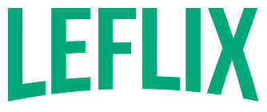

<h1 align='center'>Leflix - #ImersaoReact</h1>

<h3>🔖 Descrição</h3>

Criação do Leflix, app web utilizando React na semana da #ImersãoReact da Alura.

<h3>ℹ️ Como usar</h3>

    # Clone esse repositório
    $ git clone https://github.com/leandrobarbieri/leflix.git
    
    # Instalar dependências
    $ yarn
    
    # Executar
    $ yarn start

<h3>🖼 Layout</h3>

<h3>📝 Licença</h3>

O projeto se encontra sob licença MIT. Para mais detalhes, acesse <a href='LICENSE'>license<a>.

Criado com 💚 por <a href='https://github.com/leandrobarbieri/' target='blank'>Leandro Barbieri</a>
